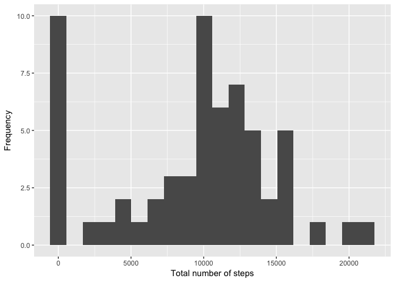

# Reproducible Research: Peer Assessment 1
Gustavo Recio  
5/11/2017  

## Introduction
This document is the first assignment for the coursera "Reproducible Research" course.

The assignment makes use of data from a personal activity monitoring device. This device collects data at 5 minute intervals throughout the day. The data consists of two months of data from an anonymous individual collected during the months of October and November, 2012 and include the number of steps taken in 5 minute intervals each day.

This document presents the results written in a single R markdown document that can be processed by knitr and transformed into various markup formats such as PDF or HTML.

## R setup


```r
library(knitr)
library(dplyr)
```

```
## 
## Attaching package: 'dplyr'
```

```
## The following objects are masked from 'package:stats':
## 
##     filter, lag
```

```
## The following objects are masked from 'package:base':
## 
##     intersect, setdiff, setequal, union
```

```r
opts_chunk$set(echo = TRUE, cache = FALSE)
```


## Loading and preprocessing the data
Downloading the data

```r
url <- "https://d396qusza40orc.cloudfront.net/repdata%2Fdata%2Factivity.zip"
destfile <- "step_data.zip"
download.file(url, destfile)
unzip(destfile)
activity <- read.csv("activity.csv", sep = ",")
```

Some preliminary analysis of the data:

```r
names(activity)
```

```
## [1] "steps"    "date"     "interval"
```

```r
str(activity)
```

```
## 'data.frame':	17568 obs. of  3 variables:
##  $ steps   : int  NA NA NA NA NA NA NA NA NA NA ...
##  $ date    : Factor w/ 61 levels "2012-10-01","2012-10-02",..: 1 1 1 1 1 1 1 1 1 1 ...
##  $ interval: int  0 5 10 15 20 25 30 35 40 45 ...
```

```r
head(activity[which(!is.na(activity$steps)), ]) # data set with NA rows removed
```

```
##     steps       date interval
## 289     0 2012-10-02        0
## 290     0 2012-10-02        5
## 291     0 2012-10-02       10
## 292     0 2012-10-02       15
## 293     0 2012-10-02       20
## 294     0 2012-10-02       25
```


## What is mean total number of steps taken per day?

```r
library(dplyr)
total_per_day <- activity %>%
  group_by(date) %>%
  summarize(Total=sum(steps, na.rm=TRUE))

head(total_per_day)
```

```
## # A tibble: 6 x 2
##         date Total
##       <fctr> <int>
## 1 2012-10-01     0
## 2 2012-10-02   126
## 3 2012-10-03 11352
## 4 2012-10-04 12116
## 5 2012-10-05 13294
## 6 2012-10-06 15420
```
Histogram graph:

```r
library(ggplot2)
ggplot(total_per_day, aes(Total)) + geom_histogram(bins = 20) + labs(x="Total number of steps", y="Frequency")
```

<!-- -->

Summary of total steps, including mean and median

```r
summary(total_per_day$Total)
```

```
##    Min. 1st Qu.  Median    Mean 3rd Qu.    Max. 
##       0    6778   10395    9354   12811   21194
```

## What is the average daily activity pattern?

First calculate using dplyr

```r
interval_average <- activity %>%
  group_by(interval) %>%
  summarize(avg=mean(steps, na.rm=TRUE))

head(interval_average)
```

```
## # A tibble: 6 x 2
##   interval       avg
##      <int>     <dbl>
## 1        0 1.7169811
## 2        5 0.3396226
## 3       10 0.1320755
## 4       15 0.1509434
## 5       20 0.0754717
## 6       25 2.0943396
```
Now create a graph to demonstrate it

```r
with(interval_average,
     plot(interval,
          avg,
          type="l",
          xlab="5-minute intervals",
          ylab="Average steps in the interval across all days"))
```

<!-- -->


## Imputing missing values
How many missing values do we have?

```r
sum(is.na(activity$steps))
```

```
## [1] 2304
```

```r
mean(is.na(activity$steps))
```

```
## [1] 0.1311475
```

```r
table(is.na(activity$steps))
```

```
## 
## FALSE  TRUE 
## 15264  2304
```

We have 2304 (or 13%) of values with NAs

One strategy to fill missing values is simply to replace them with the average for that particular interval

```r
activity$steps_with_no_na <- ifelse(
  is.na(activity$steps), 
  round(interval_average$avg[match(activity$interval, interval_average$interval)], 0), 
  activity$steps)
```

Create a new data set with the new data

```r
activity_no_na <- data.frame(steps=activity$steps_with_no_na, interval=activity$interval, date=activity$date)
head(activity_no_na, n=10)
```

```
##    steps interval       date
## 1      2        0 2012-10-01
## 2      0        5 2012-10-01
## 3      0       10 2012-10-01
## 4      0       15 2012-10-01
## 5      0       20 2012-10-01
## 6      2       25 2012-10-01
## 7      1       30 2012-10-01
## 8      1       35 2012-10-01
## 9      0       40 2012-10-01
## 10     1       45 2012-10-01
```

Re running the histogram with no missing values:

```r
total_per_day <- activity_no_na %>%
  group_by(date) %>%
  summarize(Total=sum(steps, na.rm=TRUE))

ggplot(total_per_day, aes(Total)) + geom_histogram(bins = 20) + labs(x="Total number of steps", y="Frequency")
```

<!-- -->

Mean and median:

```r
summary(total_per_day$Total)
```

```
##    Min. 1st Qu.  Median    Mean 3rd Qu.    Max. 
##      41    9819   10762   10766   12811   21194
```

## Are there differences in activity patterns between weekdays and weekends?

First lets add a new variable to the data set to differenciate weekdays / weekend

```r
activity_no_na$RealDate <- as.Date(activity_no_na$date, format = "%Y-%m-%d")
activity_no_na$weekday <- weekdays(activity_no_na$RealDate)
activity_no_na$DayType <- ifelse(activity_no_na$weekday=='Saturday' | activity_no_na$weekday=='Sunday', 'weekend','weekday')
# see first 10 values
head(activity_no_na, n=10)
```

```
##    steps interval       date   RealDate weekday DayType
## 1      2        0 2012-10-01 2012-10-01  Monday weekday
## 2      0        5 2012-10-01 2012-10-01  Monday weekday
## 3      0       10 2012-10-01 2012-10-01  Monday weekday
## 4      0       15 2012-10-01 2012-10-01  Monday weekday
## 5      0       20 2012-10-01 2012-10-01  Monday weekday
## 6      2       25 2012-10-01 2012-10-01  Monday weekday
## 7      1       30 2012-10-01 2012-10-01  Monday weekday
## 8      1       35 2012-10-01 2012-10-01  Monday weekday
## 9      0       40 2012-10-01 2012-10-01  Monday weekday
## 10     1       45 2012-10-01 2012-10-01  Monday weekday
```

Now let's create two graphs to see if there are different patterns

```r
# create table with steps per time across weekdaydays or weekend days
StepsPerTimeDT <- aggregate(steps~interval+DayType,data=activity_no_na,FUN=mean,na.action=na.omit)
# variable time (more comprensible for the graph axis)
StepsPerTimeDT$time <- StepsPerTimeDT$interval/100
# draw the line plot
j <- ggplot(StepsPerTimeDT, aes(time, steps))
j+geom_line(col="darkred")+ggtitle("Average steps per time interval: weekdays vs. weekends")+xlab("Time")+ylab("Steps")+theme(plot.title = element_text(face="bold", size=12))+facet_grid(DayType ~ .)
```

<!-- -->
